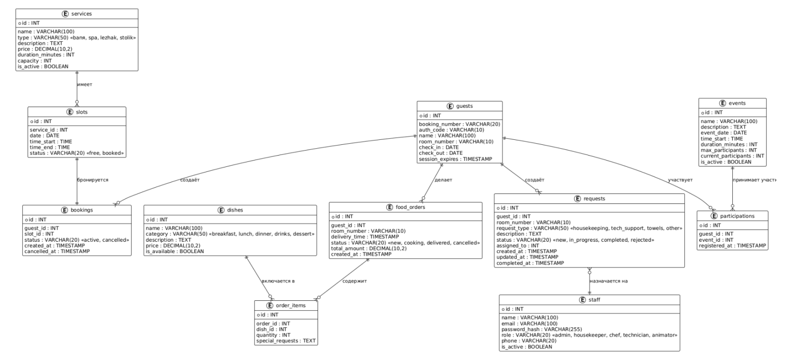

# ER-модель базы данных StayService

## Визуальная схема базы данных

[Ссылка на схему](images/erd.png)

## Ключевые сущности

База данных состоит из 11 таблиц, объединённых внешними ключами:

1. **guests**: гости гостиницы с данными авторизации (номер бронирования и одноразовый код, полученный при заселении).
2. **staff**: все сотрудники гостиницы, различающиеся по полю role (администратор, горничная, повар, техник, аниматор).
3. **services** и **slots**: справочник допуслуг и их временные слоты.
4. **bookings**: бронирования допуслуг, связывающие гостя со слотом.
5. **dishes**, **food_orders**, **order_items**: структура заказа еды (блюда, заказ, позиции заказа).
6. **requests**: заявки гостей на персонал с возможностью назначения ответственного сотрудника.
7. **events** и **participations**: мероприятия и записи гостей на них.

## Описание связей

1. **Гость и услуги:** Один гость может создать множество бронирований (`bookings`), заказов еды (`food_orders`) и заявок (`requests`).
2. **Услуги и слоты:** Каждая услуга (`services`) имеет множество временных слотов (`slots`). Слот бронируется строго одним гостем в единицу времени.
3. **Заказы еды:** Заказ (`food_orders`) состоит из множества позиций (`order_items`), каждая из которых ссылается на конкретное блюдо (`dishes`).
4. **Заявки и персонал:** Заявка гостя (`requests`) может быть назначена на конкретного сотрудника (`staff`).
5. **Мероприятия:** Мероприятие (`events`) принимает множество участников через связующую таблицу `participations`, что позволяет контролировать лимит мест.
